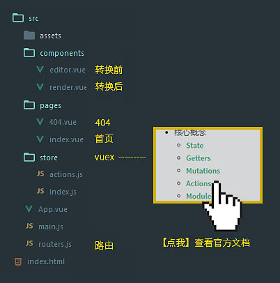

## Markdown 编辑器

熟悉一下 Vuex 的项目结构。

[【Demo】](http://ovhkjvhoy.bkt.clouddn.com/markdown-editor2)

[参考代码：强撸一发暗黑风 markdown 日记应用](https://segmentfault.com/a/1190000005787179#articleHeader5)

## 文档结构

[](https://vuex.vuejs.org/zh-cn/structure.html)

store 可以根据需要拆分为这样几个结构：`actions.js`、`getters.js` 、`mutations.js`、`modules`，

然后记得导入到 `index.js` 里：

```js
export default new Vuex.Store({
  actions,
  getters,
  modules: {
    cart,
    products
  }
})
```

[官方示例](https://github.com/vuejs/vuex/blob/dev/examples/shopping-cart/store/index.js)

## 实现思路

`state` 对象分别保存 源码 和 转换结果：

```js
state: {
  rawHTML: '',
  renderHTML: ''
}
```

通过 `action` 转换 markdown 后提交给 `mutation`：

```js
// actions
export const GET_RESULT = ({ commit }, e) => {
  let _inputHTML = {
    before: e.target.value,         // 输入框中的源码
    after: marked(e.target.value)   // 使用 marked 插件转换后的 html
  }
  // 提交给 mutations
  commit('SHOW_RESULT', _inputHTML)
}
```

提交 `mutation` 更新 `state`：
```js
// mutations
mutations: {
  SHOW_RESULT(state, _inputHTML) {
    state.rawHTML = _inputHTML.before
    state.renderHTML = _inputHTML.after
  }
}
```

组件里通过 `<textarea>` 的 `input` 事件来触发 `action`：

```html
<textarea
  :value="rawHTML"
  @input="renderAction">
</textarea>

<script>
  // 从 getters 获取 getRawHTML
  computed: {
    rawHTML() {
      return this.$store.getters.getRawHTML
    }
  },
  // 通过 input 事件触发 actions
  methods: {
    renderAction(e) {
      this.$store.dispatch('GET_RESULT', e)
    }
  }
</script>
```